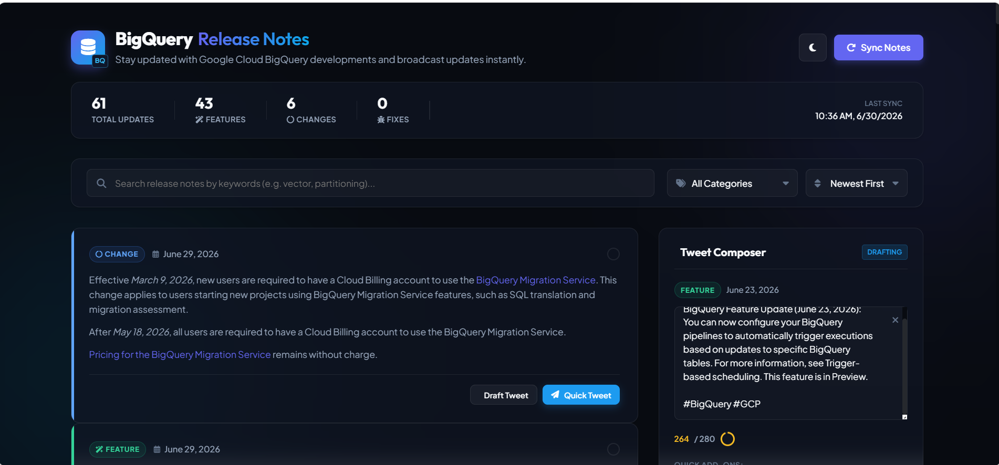

# 📊 BigQuery Release Notes Tracker & Broadcaster

A premium, highly interactive dashboard that tracks Google Cloud BigQuery release notes, parses daily update summaries into distinct tweetable announcements, and enables users to customize and broadcast updates directly to X (Twitter).

Built using **Python Flask** on the back-end and **Vanilla HTML5, CSS3, and JavaScript** on the front-end.

---


---

## ✨ Features

- **Granular Update Parsing**: Google's release note feed groups multiple announcements (e.g., a *Feature* and a *Change*) under a single daily entry. This app parses the entry HTML and splits it into individual card items to make tweeting specific updates clean.
- **Smart Tweet Builder**:
  - Automatically compiles standard update draft templates.
  - Dynamically calculates the available text area and **safely truncates descriptions** to guarantee the entire tweet remains under the 280-character limit when appending metadata, links, and hashtags.
  - Add quick hashtags (`#BigQuery`, `#GCP`, etc.) or the official release notes link at the click of a button.
  - An SVG character count progress ring that changes color (blue ➔ yellow ➔ red) as you near or exceed the limit.
- **Instant Synchronization & Local Cache**: A simple, animated sync button fetches the latest feed details, updates stats, and caches data locally (`release_notes_cache.json`) to minimize feed loading latency.
- **Unified Search & Filters**: Live filter-as-you-type search bar, filter by update category (Features, Changes, Fixes, Deprecations), and sorting control (Newest/Oldest first).
- **Premium User Interface**: Modern glassmorphic panel elements, custom typography, neon glow background spheres, and a responsive grid layout.
- **Dual-Theme Support**: Dark mode by default, toggleable to a clean light theme, with user preference stored in LocalStorage.

---

## 🛠️ Technology Stack

- **Back-End**: Python 3.11, Flask, Requests.
- **Parser**: XML ElementTree (standard library), HTMLParser (standard library).
- **Front-End**: Vanilla HTML5, CSS3, ES6 JavaScript.
- **Fonts & Icons**: Outfit & Plus Jakarta Sans (Google Fonts), FontAwesome CDN icons.

---

## 📁 File Structure

```text
vibecode-event-talks-app-antigravity/
│
├── app.py                     # Flask back-end & feed parser
├── requirements.txt           # Python application dependencies
├── .gitignore                 # Files excluded from git tracking
├── README.md                  # Project documentation (this file)
│
├── templates/
│   └── index.html             # Dashboard structure & layouts
│
└── static/
    ├── css/
    │   └── style.css          # Dark/Light theme, glassmorphic styles, & animations
    └── js/
        └── app.js             # API fetches, search filters, & tweet composer logic
```

---

## 🚀 Getting Started

### Prerequisites
Make sure Python 3.11+ is installed on your computer.

### Installation
1. Clone the repository or navigate to the directory:
   ```bash
   cd vibecode-event-talks-app-antigravity
   ```

2. Install Python dependencies:
   ```bash
   pip install -r requirements.txt
   ```

### Running the Application
Start the Flask local development server:
```bash
python app.py
```

The application will start in debug mode on:
👉 **[http://127.0.0.1:5000](http://127.0.0.1:5000)**

---

## 🐦 How to Broadcast Updates
1. Click **"Draft Tweet"** on any release card (or click the card itself).
2. The right-hand column will activate the **Tweet Composer** and pre-populate your draft.
3. Edit the text directly inside the textarea. Use the character progress circle to keep your text within 280 characters.
4. Click on standard hashtag chips or click **Link** to append the official reference.
5. Click **"Tweet Broadcast"** to open a new tab containing the pre-filled post on X (Twitter).
